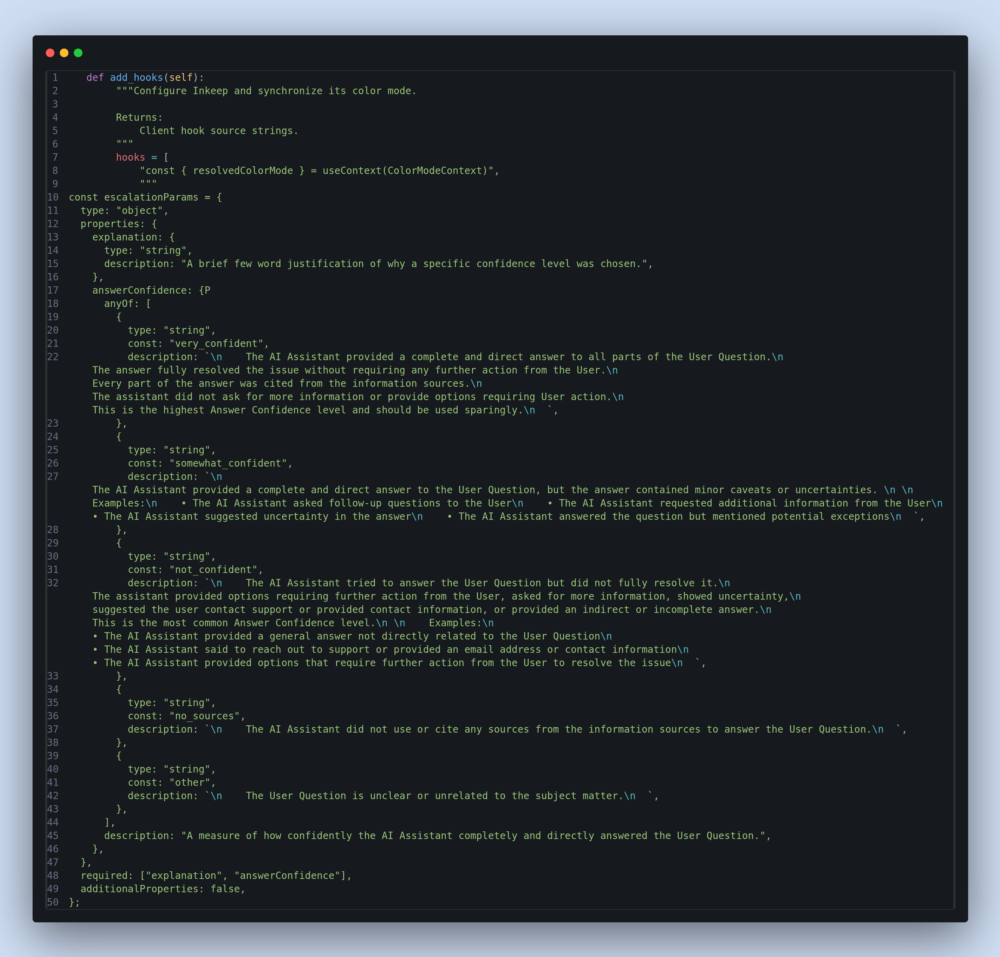
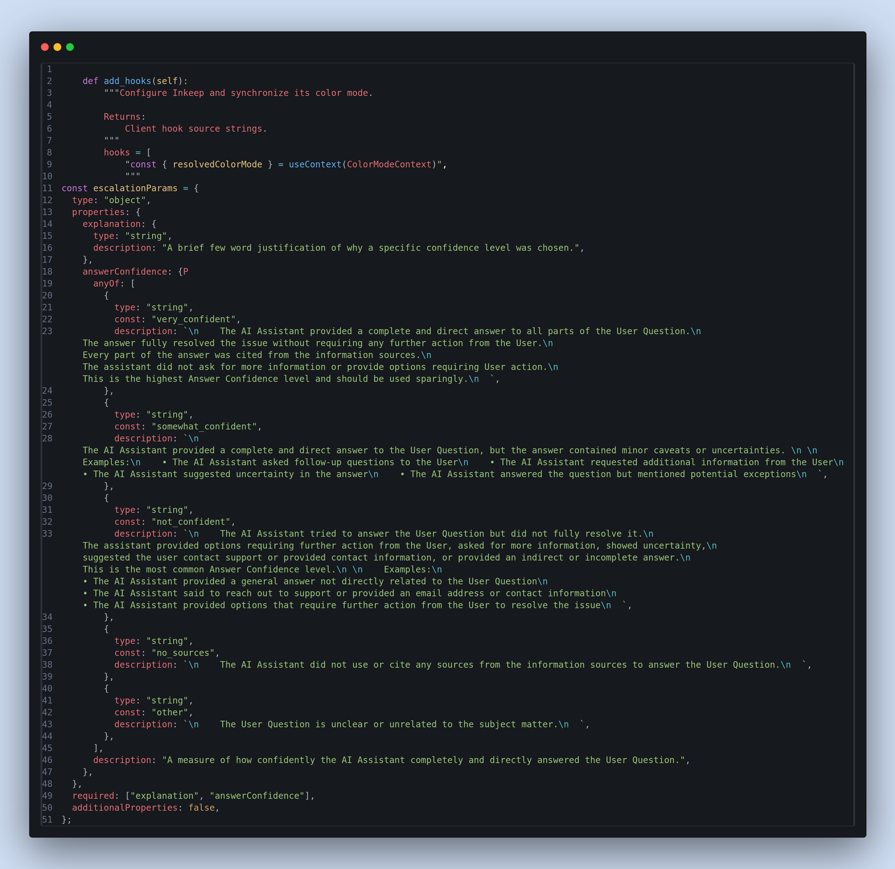

# Reflex Embedded Languages

Syntax highlighting and IntelliSense for the CSS, JavaScript, JSX, HTML, and Tailwind code embedded in [Reflex](https://reflex.dev) Python strings.

Reflex apps routinely embed other languages inside Python — Tailwind classes in `class_name`, CSS in `style` dicts, JavaScript in `rx.call_script`, JSX in custom components. VS Code treats all of it as plain strings. This extension makes those strings first-class: proper colors, completions, and hovers, powered by the language services you already have installed.

| Before | After |
|:---:|:---:|
|  |  |

## Features

- **Syntax highlighting** for embedded CSS, JavaScript, JSX, TypeScript, and HTML inside Reflex API calls.
- **Completions and hovers** in embedded code — CSS property names and values, JavaScript/HTML completions forwarded to VS Code's built-in language services.
- **Tailwind CSS IntelliSense integration** — `class_name` props get class completions with color swatches, out of the box.
- **f-string aware** — `{placeholders}` inside embedded strings keep Python highlighting and Python completions.
- **Comment tags** to opt in anywhere: put `# language=js` (or `# js`, `# css`, `# html`, `# jsx`, `# ts`) on the line above a string, or as the first line of a triple-quoted string.

## Supported contexts

| Context | Example | Language |
|---|---|---|
| `class_name=` (str / list / f-string) | `rx.box(class_name="flex gap-2")` | Tailwind |
| `style={...}`, pseudo props, `rx.Style({...})` | `style={"font_size": "16px"}` | CSS |
| CSS-property kwargs | `background_image="linear-gradient(...)"` | CSS |
| `rx.el.style("...")` | raw stylesheet child | CSS |
| `rx.call_script` / `rx.run_script` / `rx.call_function` | `rx.call_script("console.log(1)")` | JavaScript |
| `rx.Var("...")` / `Var(_js_expr=...)` | `rx.Var("(e) => e.id")` | JavaScript |
| `rx.script("...")` | inline script body | JavaScript |
| `rx.html("...")` | `rx.html("<h2>hi</h2>")` | HTML |
| `add_hooks` / `add_custom_code` return strings | triple-quoted JSX bodies | JSX |
| Comment tag | `# language=js` above any string | js / jsx / ts / css / html |

## Installation

The extension is not on the VS Code Marketplace yet. Build and install it from a clone of this repository:

```bash
git clone https://github.com/FarhanAliRaza/reflex-vscode.git
cd reflex-vscode
pnpm install
pnpm build
pnpm package
code --install-extension reflex-vscode-*.vsix
```

### Tailwind completions

Tailwind support is delegated to the official [Tailwind CSS IntelliSense](https://marketplace.visualstudio.com/items?itemName=bradlc.vscode-tailwindcss) extension — this extension ships the configuration that teaches it about Reflex's `class_name` prop. To enable it:

1. Install Tailwind CSS IntelliSense.
2. Keep a `tailwind.config.js` in your workspace root.

## Settings

| Setting | Default | Description |
|---|---|---|
| `reflex.embedded.enableCompletions` | `true` | Provide completions inside embedded CSS/JS/HTML strings. |

The command **Reflex: Show Embedded Regions in Active File** lists every region the extension detected in the current file, which is useful when a string is not highlighting as expected.

## Limitations

- Highlighting requires the opening quote on the same line as the trigger (`rx.call_script("""`). If the string opens on the next line, completions still work but colors are absent — add a comment tag to restore them.
- In f-strings, `{{` and `}}` are shown as Python escapes, so JavaScript object literals inside f-strings can look slightly off.
- CSS-property kwargs are matched on any Python call, not only Reflex components. Common non-CSS prop names (`src`, `alt`, `size`, ...) are excluded via a blocklist.
- If you use the [ty](https://github.com/astral-sh/ty) language server, its semantic tokens override embedded highlighting. See [DEVELOPMENT.md](DEVELOPMENT.md#ty-semantic-token-override) for a workaround.

## Contributing

See [DEVELOPMENT.md](DEVELOPMENT.md) for build instructions, tests, and an overview of the architecture.

## License

[MIT](LICENSE)
